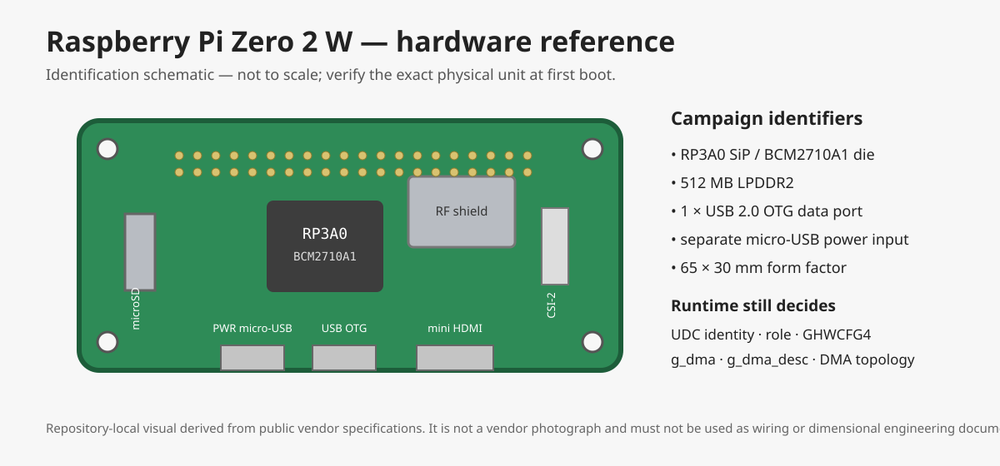

# Raspberry Pi Zero 2 W — hardware profile



> The repository image above is a local identification schematic, not a vendor photograph and not an electrical/mechanical drawing. The exact delivered board should be photographed and its silk-screen/revision recorded when it arrives.

## Campaign role

```text
STATE                 ACQUIRED / IN TRANSIT
CURRENT ROLE          PRIMARY-A first real DWC2 runtime target
FIRST-BOOT ARTIFACTS  PI-FB1 + PI-FB2 in one boot
NEXT IF SURVIVES      PI-R1A -> PI-G25 -> conditional PI-G6
TOPOLOGY SCOPE        Pi-only; no DMA conclusion transfers to RK3288
```

Command runbook: [`PI-ZERO-2W-COMMANDS.md`](PI-ZERO-2W-COMMANDS.md)

Acquisition gate: [`../HARDWARE-ACQUISITION-GATE.md`](../HARDWARE-ACQUISITION-GATE.md)

## Evidence classes

This profile separates three kinds of statements:

- **VENDOR-SPEC** — published Raspberry Pi hardware specification.
- **SOURCE-PROVEN** — fact established from the campaign's pinned Linux/DWC2 source.
- **RUNTIME-PENDING** — must be read from the actual delivered board and running kernel; do not infer it from marketing material or another platform.

## Hardware identification

| Field | Value | State |
|---|---|---|
| Exact model | Raspberry Pi Zero 2 W | VENDOR-SPEC |
| SiP | Raspberry Pi RP3A0 | VENDOR-SPEC |
| SoC die | Broadcom BCM2710A1 | VENDOR-SPEC |
| CPU | 4 × 64-bit Arm Cortex-A53 @ 1 GHz | VENDOR-SPEC |
| RAM | 512 MB LPDDR2 SDRAM | VENDOR-SPEC |
| Board size | 65 mm × 30 mm | VENDOR-SPEC |
| Wireless | 2.4 GHz 802.11 b/g/n; Bluetooth 4.2; BLE | VENDOR-SPEC |
| USB data | 1 × USB 2.0 OTG interface, micro-USB connector | VENDOR-SPEC |
| Power input | separate micro-USB power input; product brief specifies 5 V DC / 2.5 A | VENDOR-SPEC |
| Storage | microSD card slot | VENDOR-SPEC |
| Display | mini HDMI | VENDOR-SPEC |
| Camera | CSI-2 connector | VENDOR-SPEC |
| GPIO | HAT-compatible 40-pin header footprint, unpopulated on Zero 2 W | VENDOR-SPEC |

## Why this board matters to R1

The Pi is already paid for, so the procurement objective is to extract every inexpensive decisive artifact from it before another board can be justified.

Its USB OTG interface makes it a low-cost candidate for real gadget-mode DWC2 qualification. The first boot is intentionally front-loaded with the two cheapest hardware gates:

```text
PI-FB1  real DWC2 UDC + usable peripheral/operational state
PI-FB2  GHWCFG4.DESC_DMA + effective g_dma/g_dma_desc
```

A decisive R1A result on this board can eliminate the need to buy Tinker Board S. A Pi-specific controller limitation does **not** kill the RK3288 branch.

## Pinned DWC2 source facts

Campaign Linux pin:

```text
f5a7e2ae5f0a9a5caf59501457938eeb249a7dc8
```

At this pin, `drivers/usb/dwc2/params.c::dwc2_set_bcm_params()` changes only:

```text
host_rx_fifo_size
max_transfer_size
max_packet_count
ahbcfg
```

It does **not** override `g_dma`, `g_dma_desc`, or `dr_mode`.

For gadget-capable peripheral/OTG mode the generic parameter path derives:

```text
g_dma      <- dma_capable
             where dma_capable := hw->arch != GHWCFG2_SLAVE_ONLY_ARCH

g_dma_desc <- hw->dma_desc_enable
             where hw->dma_desc_enable <- GHWCFG4.DESC_DMA
```

Therefore this source branch is closed:

```text
"BCM platform parameters force gadget DMA off on Pi"
    -> KILLED_BY_SOURCE at the pinned DWC2 tree
```

This does **not** prove that the delivered Pi reports DMA-capable hardware or descriptor DMA; those are runtime facts.

The DWC2 completion path also performs the request DMA unmap only when `using_dma(hsotg)` is true. Thus `g_dma` remains load-bearing for the lifetime experiment.

## Runtime facts that must not be assumed

The following stay `RUNTIME-PENDING` until captured from the exact board/kernel epoch:

| Field | Required artifact |
|---|---|
| Running kernel / architecture | `uname -a`, `.config`, `/proc/cmdline` |
| Active board DT/overlays | live DT dump and boot configuration |
| DWC2 UDC identity | `/sys/class/udc` plus driver/device linkage |
| Actual USB role/state | DWC2 debugfs / role state; operational peripheral state when connected |
| `GHWCFG2` architecture | DWC2 `regdump` / `hw_params` |
| `GHWCFG4.DESC_DMA` | DWC2 `regdump` and decoded bit |
| Effective `g_dma` | DWC2 `params` |
| Effective `g_dma_desc` | DWC2 `params` |
| `dma-ranges` / bus translation | active DT and per-mapping translation artifact |
| IOMMU attachment | runtime device/IOMMU evidence |
| SWIOTLB initialization/use | running `.config`, boot evidence, and per-mapping bounce-membership artifact |
| Actual mapping classification | `PI-G25` fields from the evidence-bearing request |

## G2.5 rule for this board

Do not classify a Pi mapping as bounce merely because:

```text
req->dma != cpu_phys
```

A bus translation can change the raw DMA address without a bounce buffer. The Pi row must record the semantic mapping fields defined by the acquisition gate:

```text
cpu_va
cpu_phys
dma_addr
translated_dma_phys
dma_ops/backend
iommu_mapped
dma_mask
bus_dma_limit
active dma-ranges context
bounce_membership
bounce_membership_method
```

The Pi classification is independent from the Tinker/RK3288 classification.

## Required physical items for the campaign

Minimum practical set for first-boot and gadget work:

- Raspberry Pi Zero 2 W itself;
- microSD card with a known image;
- stable micro-USB power supply/cable appropriate for the board;
- **data-capable** micro-USB cable for the USB OTG port;
- separate Linux USB host for the R1 host harness.

Do not buy extra adapters/hubs merely because they are convenient. They enter the hardware budget only if an experiment dependency requires them.

## Arrival identity capture

When the board arrives, add to the first evidence directory:

```text
photo-top.jpg
photo-bottom.jpg
package-label.jpg        # if useful and non-sensitive
board-silkscreen.txt
physical-revision.txt
```

The physical photographs become the authoritative record of the purchased unit. The repository schematic remains only a navigation/identification image.

## Sources

Vendor:

- Raspberry Pi product page: https://www.raspberrypi.com/products/raspberry-pi-zero-2-w/
- Raspberry Pi Zero 2 W product brief: https://datasheets.raspberrypi.com/rpizero2/raspberry-pi-zero-2-w-product-brief.pdf
- Raspberry Pi official documentation hardware overview: https://www.raspberrypi.com/documentation/computers/raspberry-pi.html

Pinned Linux source:

- https://github.com/torvalds/linux/blob/f5a7e2ae5f0a9a5caf59501457938eeb249a7dc8/drivers/usb/dwc2/params.c
- https://github.com/torvalds/linux/blob/f5a7e2ae5f0a9a5caf59501457938eeb249a7dc8/drivers/usb/dwc2/gadget.c

Official product-photo provenance reference:

- Raspberry Pi documentation repository contains `documentation/asciidoc/computers/raspberry-pi/images/zero-2-w.jpg`; this profile does not copy that vendor photograph into the campaign repository. The local SVG is deliberately provenance-safe and clearly marked as a schematic.
