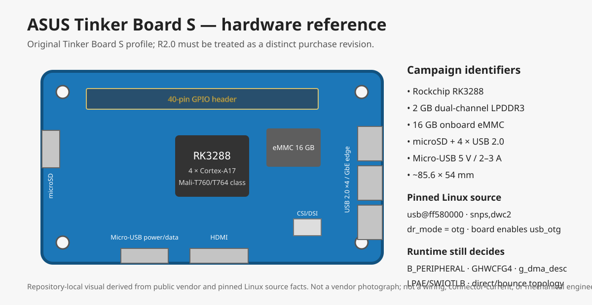

# ASUS Tinker Board S — hardware profile



> The repository image above is a local identification schematic, not a vendor photograph and not an electrical/mechanical drawing. The exact purchase revision must be confirmed before ordering and photographed when received.

## Campaign role

```text
STATE                 DEFERRED
PURCHASE AUTHORITY    NONE until AQ-D1
INTENDED ROLE         RK3288 topology / possible PRIMARY-B follow-on
FIRST-BOOT ARTIFACTS  RK-FB0 + RK-FB1 + RK-FB2
NEXT IF SURVIVES      RK-G25 -> topology-dependent RK-R1/R2/R3
TOPOLOGY SCOPE        RK3288/Tinker only; no Pi DMA conclusion transfers here
```

Command runbook: [`TINKER-BOARD-S-COMMANDS.md`](TINKER-BOARD-S-COMMANDS.md)

Acquisition gate: [`../HARDWARE-ACQUISITION-GATE.md`](../HARDWARE-ACQUISITION-GATE.md)

## Exact model boundary

The current research candidate is the **original ASUS Tinker Board S based on RK3288 with 2 GB LPDDR3 and 16 GB eMMC**.

ASUS also sells/has sold **Tinker Board S R2.0**. It is closely related but must not be silently substituted in the evidence record. Before purchase, the listing must state the exact model/revision. If R2.0 is cheaper or easier to acquire, it is evaluated as a substitute under the acquisition gate rather than assumed equivalent.

## Evidence classes

- **VENDOR-SPEC** — published ASUS hardware specification.
- **SOURCE-PROVEN** — fact established from the campaign's pinned upstream Linux source.
- **RUNTIME-PENDING** — must be read from the exact delivered board and running kernel/DTB.

## Hardware identification

| Field | Value | State |
|---|---|---|
| Exact target | ASUS Tinker Board S, original revision unless procurement record says otherwise | VENDOR-SPEC / procurement boundary |
| SoC | Rockchip RK3288 | VENDOR-SPEC |
| CPU | 4 × Arm Cortex-A17, up to 1.8 GHz in ASUS specification | VENDOR-SPEC |
| GPU | Arm Mali-T760/T764 family as reported by ASUS documentation | VENDOR-SPEC |
| RAM | 2 GB dual-channel LPDDR3 | VENDOR-SPEC |
| Onboard storage | 16 GB eMMC | VENDOR-SPEC |
| Removable storage | microSD card slot | VENDOR-SPEC |
| USB host ports | 4 × USB 2.0 | VENDOR-SPEC |
| Ethernet | Gigabit Ethernet | VENDOR-SPEC |
| Wireless | 802.11 b/g/n Wi-Fi; Bluetooth 4.0 + EDR on original Tinker Board S specification | VENDOR-SPEC |
| Power connector | micro-USB, ASUS specifies 5 V / 2–3 A | VENDOR-SPEC |
| Display | HDMI plus 15-pin MIPI DSI | VENDOR-SPEC |
| Camera | 15-pin MIPI CSI | VENDOR-SPEC |
| GPIO | 40-pin header | VENDOR-SPEC |
| Board dimensions | 3.37 in × 2.125 in, approximately 85.6 × 54.0 mm | VENDOR-SPEC |

## Why this board is in the campaign

The Tinker Board S is not the next purchase automatically. It exists in the plan because RK3288 provides a materially different DMA/topology branch from the already-acquired Pi.

The purchase becomes justified only if Pi results leave a live dependency that specifically needs the RK3288 DWC2 topology, descriptor-DMA capability, or a topology-dependent R2/R3 observation.

The intended sequence is:

```text
Pi evidence
   |
   +-- decisive result ------------------> no Tinker purchase
   |
   +-- RK3288-specific blocker survives -> AQ-D1
                                           |
                                           +-- JUSTIFIED -> buy one Tinker S
```

## Pinned upstream Linux facts

Campaign Linux pin:

```text
f5a7e2ae5f0a9a5caf59501457938eeb249a7dc8
```

### Board identity and memory

`arch/arm/boot/dts/rockchip/rk3288-tinker-s.dts` identifies:

```text
model      = "Rockchip RK3288 Asus Tinker Board S"
compatible = "asus,rk3288-tinker-s", "rockchip,rk3288"
```

The included `rk3288-tinker.dtsi` declares 2 GB of RAM starting at physical address zero:

```text
memory reg = <0x0 0x0 0x0 0x80000000>
```

### DWC2 instance

The RK3288 SoC DTS contains:

```text
usb_otg: usb@ff580000 {
    compatible = "rockchip,rk3288-usb",
                 "rockchip,rk3066-usb",
                 "snps,dwc2";
    reg = <0x0 0xff580000 0x0 0x40000>;
    dr_mode = "otg";
    ...
    status = "disabled";
};
```

The Tinker board DTSI then enables that node:

```text
&usb_otg {
    status = "okay";
};
```

At this pin the `usb@ff580000` node itself contains no `iommus = ...` property. This is a source-level topology fact, not yet a runtime proof of the final DMA backend.

### Source-kill status

Current campaign status for the RK3288 topology hypothesis:

```text
RK3288_DMA_TOPOLOGY = SURVIVED_SOURCE_KILL_ATTEMPT
```

The source supports continued testing; it does not authorize purchase by itself.

## Runtime facts that must not be assumed

| Field | Required artifact |
|---|---|
| Exact physical board/revision | top/bottom photographs + silkscreen/model record |
| Running kernel | `uname -a`, exact `.config`, `/proc/cmdline` |
| `CONFIG_ARM_LPAE` | running `.config` |
| `CONFIG_SWIOTLB` / dynamic SWIOTLB options | running `.config` |
| Active DTB unchanged from expected topology | live DT capture / boot provenance |
| DWC2 UDC identity | `/sys/class/udc` plus device/driver linkage to `ff580000.usb` |
| Actual role/state | DWC2 role/debugfs; `B_PERIPHERAL` or equivalent operational evidence |
| `GHWCFG2` DMA architecture | DWC2 `regdump` / `hw_params` |
| `GHWCFG4.DESC_DMA` | DWC2 `regdump` and decoded bit |
| Effective `g_dma` | DWC2 `params` |
| Effective `g_dma_desc` | DWC2 `params` |
| Device `dma_ops` / IOMMU attachment | runtime observer |
| Active `dma-ranges` context | live DT / device DMA-range map |
| SWIOTLB bounce use | per-mapping bounce-membership artifact |
| Direct vs translated vs bounced mapping | `RK-G25` evidence-bearing mapping |

## First-boot kill gates

The first boot must collect three cheap artifacts before custom observer work:

```text
RK-FB0  .config + cmdline + topology facts
RK-FB1  DWC2 UDC + actual peripheral state
RK-FB2  GHWCFG4.DESC_DMA + effective g_dma/g_dma_desc
```

Interpretation is fail-closed and scoped:

```text
RK-FB1 fails
    -> Tinker runtime branch blocked for that configuration

RK-FB2 = 0
    -> PRIMARY-B_ON_TINKER killed
    -> does not automatically erase PRIMARY-A/R1 work
```

## G2.5 mapping rule for this board

Do not use raw address equality as the classification rule. Record:

```text
cpu_va
cpu_phys
dma_addr
translated_dma_phys
dma_ops/backend
iommu_mapped
dma_mask
bus_dma_limit
active dma-ranges context
bounce_membership
bounce_membership_method
```

The desired classification is produced from the actual evidence-bearing mapping, not from boot logs alone.

## Power and connection caution

ASUS specifies micro-USB power and documents data-capable micro-USB connection to a PC for Tinker Board S eMMC/UMS workflows. For the R1 campaign, power and USB data topology must be frozen explicitly before execution so that host connection, powering method and controller role cannot become an uncontrolled variable.

Do not assume a random micro-USB cable is adequate: ASUS documentation explicitly calls for a cable/power source capable of the required current.

## Purchase identity checklist

Before any listing is authorized under `AQ-D1`, record:

```text
listing_title
exact_model
revision_if_stated
SoC
RAM
onboard_eMMC
included_heatsink
power_supply_included
shipping_cost
photos_match_profile
seller_return_policy
```

Reject or downgrade listings that only say "Tinker Board" without enough information to distinguish original Tinker Board, Tinker Board S and Tinker Board S R2.0.

## Arrival identity capture

If purchased, the first evidence directory must include:

```text
photo-top.jpg
photo-bottom.jpg
package-label.jpg        # if useful and non-sensitive
board-silkscreen.txt
physical-revision.txt
```

These photographs become authoritative for the exact tested unit.

## Sources

Vendor:

- ASUS Tinker Board S product page: https://www.asus.com/networking-iot-servers/aiot-industrial-solutions/all-series/tinker-board-s/
- ASUS Tinker Board documentation: https://tinker-board.asus.com/documentation/tbs.html
- ASUS Tinker Board S manual: https://tinker-board.asus.com/download/E17574_Tinker_Board_S_UM_V3_WEB.pdf

Pinned Linux source:

- https://github.com/torvalds/linux/blob/f5a7e2ae5f0a9a5caf59501457938eeb249a7dc8/arch/arm/boot/dts/rockchip/rk3288-tinker-s.dts
- https://github.com/torvalds/linux/blob/f5a7e2ae5f0a9a5caf59501457938eeb249a7dc8/arch/arm/boot/dts/rockchip/rk3288-tinker.dtsi
- https://github.com/torvalds/linux/blob/f5a7e2ae5f0a9a5caf59501457938eeb249a7dc8/arch/arm/boot/dts/rockchip/rk3288.dtsi

Revision note:

- ASUS Tinker Board S R2.0 is documented separately by ASUS. It is not silently treated as the same acquisition target; equivalence must be justified if it replaces the original board.
